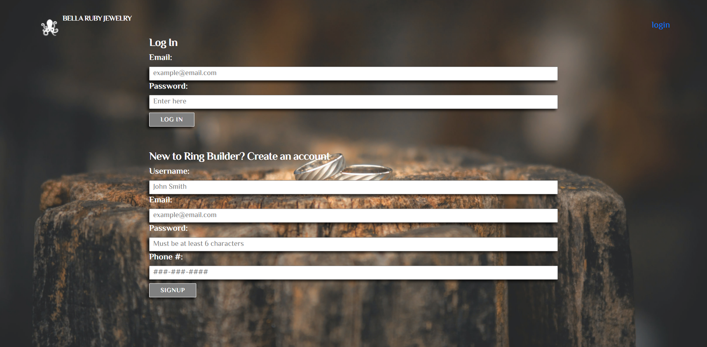
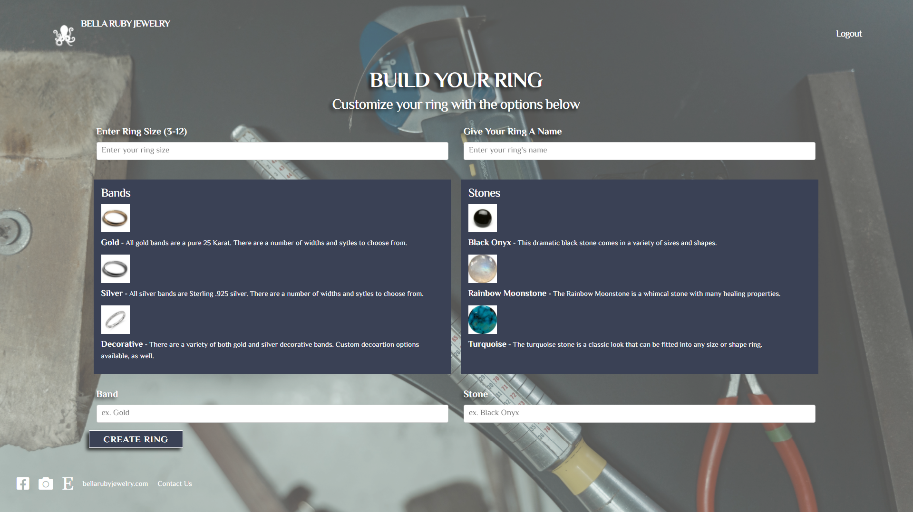

  
  
  # Ring Builder

  ## Description

  This application allows you to customize a ring. After logging in or creating an account you will be able to choose from three bands and three stones. After customizing a piece you will be able to view them in your dashboard.

  ## Deployed Link

  https://ring-builder-app.herokuapp.com/

  ## Technologies Used

  * Javascript
  * Milligram
  * Node.js
  * Express.js
  * Handlebars
  * mySQL

  ## Table of Contents

  * [Installation](#installation)
  * [Usage](#usage)
  * [Credits](#credits)
  * [License](#license)

  ## Installation

  No installation is required.

  ## Usage

  You follow the deployed URL and if you are a first time user you will need to create an account or login if you are already a user. After that you will click build a ring and choose which band and stone you desire. Once it's created you can view it in your dashboard.

  ## Contributed By:

  * Alexandros Vlamakis
  * Berke Forbes
  * Lisseth Diaz
  * Scott Nichols

  ## License

  None
  

  ---

  ## Tests

  No tests 

  ## Questions

  If you have questions:
  * [Github](https://github.com/sessions21)
  * [Email](mailto:s21nichols@hotmail.com) 

  ## Preview Screenshot
  
  
  

